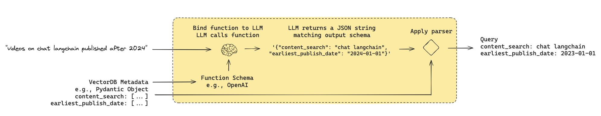

# ADVANCED RAG PIPELINES
## 3. Query Construction

> Converting natural language questions into structured queries, metadata filters, or agent tool arguments via LLM function calling and Pydantic schemas.

**Scope:** query → structured query payload (vector metadata filters, SQL, Cypher, API parameters). Not index creation or text-to-text rewriting.

---



Similar to the logical routing pattern where function calling categorizes queries into a Pydantic literal, query construction uses structured function calling to extract both semantic search strings and precise metadata filters in a single inference step.

---

## Why it exists

- **Vector search is blind to metadata:** Pure embedding similarity cannot enforce strict relational boundaries (e.g., date ranges, tenant IDs, numerical thresholds, exact categories).
- **Corpus heterogeneity:** Real-world enterprise knowledge is distributed across relational databases (SQL), graph databases (Neo4j/Cypher), and semi-structured document stores.
- **Precision vs. recall trade-off:** Keyword/vector matching retrieves semantically close chunks that violate strict constraints (e.g., matching a tutorial published in 2021 when the user explicitly asked for 2024).

---

## Core mechanism

```
User Prompt: "Show me Python LangChain tutorials from 2024 with over 10,000 views"
                               │
                               ▼
            ┌──────────────────────────────────────┐
            │       LLM Function Calling           │
            │   (Enforced by Pydantic Schema)      │
            └──────────────────────────────────────┘
                               │
       ┌───────────────────────┴───────────────────────┐
       ▼                                               ▼
Semantic Search Text:                          Structured Filters:
"Python LangChain tutorials"                   - year == 2024
                                               - view_count >= 10000
                               │
                               ▼
            ┌──────────────────────────────────────┐
            │   Target Execution Backend           │
            │ (Vector Metadata / SQL / Tool Call)  │
            └──────────────────────────────────────┘
```

1. **Define a strict target schema** as a Pydantic `BaseModel` specifying semantic search terms and structured filter constraints with descriptions and types.
2. **Bind the schema to the LLM** via function calling / structured output interfaces (`with_structured_output` or JSON schema tools).
3. **Parse the natural language query** into an instantiated Pydantic object containing typed attributes.
4. **Compile the structured object** into the native target query format (e.g., Chroma/Pinecone filter dict, SQL statement, Cypher clause, or tool execution args).
5. **Execute the structured retrieval** against the database or pass the arguments to downstream agent tools.

---

## Variants

| Variant | Target Backend | Mechanism | Cost | Best for |
|---|---|---|---|---|
| **Text-to-Metadata Filter** | Vector DB (Chroma, Pinecone, Qdrant) | LLM extracts semantic string + metadata dictionary (`year`, `author`, `tags`) | 1 LLM call (~200–600 ms) | Self-querying retrievers, document corpora with structured tags |
| **Text-to-SQL** | Relational DB (PostgreSQL, SQLite, Snowflake) | LLM maps question against database DDL/schema to emit valid SQL queries | 1 LLM call + optional syntax validation | Tabular facts, aggregations, metrics, exact counts, joins |
| **Text-to-Cypher** | Graph DB (Neo4j) | LLM translates query to graph pattern matching clauses (`MATCH (n)-[r]->(m)`) | 1 LLM call (demands high-capacity model) | Highly connected data, multi-hop relationship traversal |
| **Agent Tool Calling** | Python Functions / APIs | Pydantic model defines API parameters for execution in external tools | 1 LLM call | Action-oriented RAG, automated workflows, multi-engine dispatch |


---

## Minimal example

### 1. Vector Store Metadata Construction (Pydantic + Groq / LangChain)

Extracts an unstructured similarity query alongside structured range and equality filters:

```python
import datetime
from typing import Optional
from pydantic import BaseModel, Field
from langchain_groq import ChatGroq
from langchain_core.prompts import ChatPromptTemplate

# 1. Define target query schema
class TutorialSearchQuery(BaseModel):
    """Structured query for searching technical video tutorials."""

    query: str = Field(
        ...,
        description="Core semantic search query to compare against transcript embeddings."
    )
    published_year: Optional[int] = Field(
        None,
        description="Filter by publication year if explicitly specified."
    )
    min_views: Optional[int] = Field(
        None,
        description="Minimum view count threshold, inclusive."
    )
    language: Optional[str] = Field(
        None,
        description="Programming language constraint (e.g., 'python', 'javascript')."
    )

# 2. Bind schema to LLM using structured output
llm = ChatGroq(model="llama-3.3-70b-versatile", temperature=0)
structured_llm = llm.with_structured_output(TutorialSearchQuery)

system_prompt = """You are an expert query constructor. Convert user questions
into structured search parameters for a technical video database.
Do not infer filters unless explicitly requested or clearly implied."""

prompt = ChatPromptTemplate.from_messages([
    ("system", system_prompt),
    ("human", "{question}"),
])

query_constructor = prompt | structured_llm

# 3. Invoke query construction
result = query_constructor.invoke({
    "question": "Find Python videos on RAG from scratch published in 2024 with at least 5000 views"
})

print(result)
# Output:
# query='RAG from scratch' published_year=2024 min_views=5000 language='python'
```

### 2. Translating Pydantic Output to Vector Store Filter (e.g., ChromaDB)

```python
def compile_chroma_filter(structured_query: TutorialSearchQuery) -> dict:
    """Compile Pydantic structured output into Chroma $and filter syntax."""
    filters = []
    
    if structured_query.published_year:
        filters.append({"year": {"$eq": structured_query.published_year}})
    if structured_query.min_views:
        filters.append({"views": {"$gte": structured_query.min_views}})
    if structured_query.language:
        filters.append({"language": {"$eq": structured_query.language.lower()}})
        
    if not filters:
        return {}
    if len(filters) == 1:
        return filters[0]
    return {"$and": filters}

# Execution:
chroma_filter = compile_chroma_filter(result)
# Resulting filter:
# {"$and": [{"year": {"$eq": 2024}}, {"views": {"$gte": 5000}}, {"language": {"$eq": "python"}}]}

# Passed directly to retriever:
# retriever = vectorstore.as_retriever(
#     search_kwargs={"k": 5, "filter": chroma_filter}
# )
```


### 3. Direct Function Calling / Agent Tool Calling (Groq Native API)

Directly transforms prompts into a function calling structure returning the parsed Pydantic object:

```python
from groq import Groq
import json

client = Groq()

# Define function tool matching Pydantic JSON schema
tools = [
    {
        "type": "function",
        "function": {
            "name": "search_tutorial_db",
            "description": "Execute structured semantic and metadata search over tutorial index.",
            "parameters": TutorialSearchQuery.model_json_schema(),
        },
    }
]

response = client.chat.completions.create(
    model="llama-3.3-70b-versatile",
    messages=[{"role": "user", "content": "Show me Python tutorials on RAG published in 2024"}],
    tools=tools,
    tool_choice={"type": "function", "function": {"name": "search_tutorial_db"}},
)

tool_call = response.choices[0].message.tool_calls[0]
raw_arguments = json.loads(tool_call.function.arguments)

# Instantiate and validate through the Pydantic class
search_payload = TutorialSearchQuery(**raw_arguments)
print(search_payload.model_dump())
# {'query': 'RAG', 'published_year': 2024, 'min_views': None, 'language': 'python'}
```

---

## Choosing

```
What is the primary target store?
 ├─ Vector database with tags/attributes ────────► Text-to-Metadata Filter (Pydantic + Self-Query)
 ├─ Relational schema with joins & metrics ──────► Text-to-SQL (Function Calling / Schema Prompting)
 ├─ Knowledge graph with complex entity links ───► Text-to-Cypher (Graph Pattern Matching)
 └─ Action APIs / external search engines ───────► Agent Tool Calling (Pydantic Payload Execution)
```

- **Use Structured Output / Function Calling** when the target schema is fixed, strictly typed, and requires runtime validation before query execution.
- **Use Text-to-SQL / Cypher directly** when questions involve dynamic multi-table joins, relational group-by aggregations (`AVG`, `COUNT`), or graph traversals beyond static key-value filters.

---

## Failure modes

- **Hallucinated filter keys or categorical values** → LLM invents metadata attributes not present in the index. Fix: enforce `Literal[...]` or `Enum` types in Pydantic fields and inject index metadata schema in system instructions.
- **Over-filtering (Zero-recall / false negatives)** → LLM sets strict filters for soft conversational expressions (e.g., converting "recent" to `year == 2026`). Fix: instruct prompt to only set filters on explicit user constraints; add an automatic fallback to unfiltered semantic search if zero chunks match.
- **Syntax compilation errors** → Generated filter dictionaries fail when sent to vector store backends due to mismatched syntax. Fix: decouple the intermediate representation (Pydantic model) from vendor-specific compiler functions.
- **Type mismatch in generated parameters** → LLM passes strings for date or integer fields. Fix: leverage Pydantic v2 type coercion and validators (`@field_validator`).

---

## Uncertainty

- Small parameter models (<8B) frequently degrade on complex nested schemas without extensive few-shot demonstrations `(unverified)`.
- Compiling compound Boolean logic (`(A OR B) AND (C OR D)`) into vector store filter dialects often causes operator precedence errors across diverse backends.

---

## References

- [LangChain RAG From Scratch: Query Construction](https://github.com/langchain-ai/rag-from-scratch) — foundational architecture and notebook implementations.
- [LangChain Blog: Query Construction](https://blog.langchain.dev/query-construction/) — comprehensive guide to structured, semi-structured, and unstructured query translation.
- [LangChain Self-Querying Retriever](https://python.langchain.com/docs/how_to/self_query/) — structured query construction for metadata filtering.
- [Groq Tool Use Documentation](https://console.groq.com/docs/tool-use) — native function calling and JSON schema specifications.

