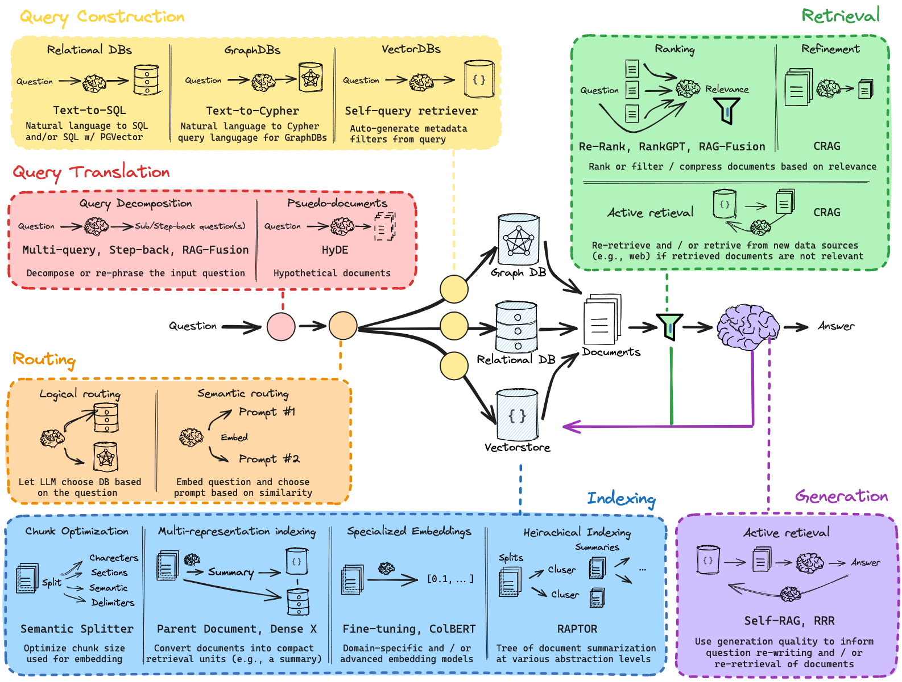
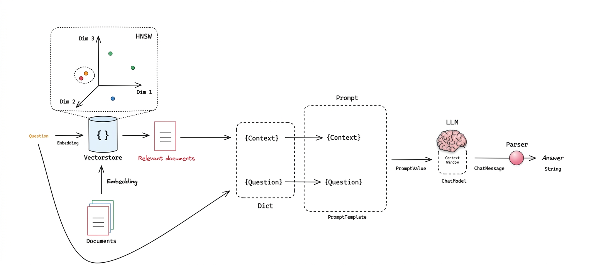
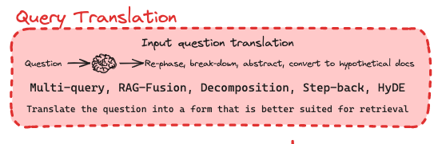

# Retrieval Augmented Generation

> **RAG** lets an LLM answer questions using knowledge it wasn't trained on
> (private docs, recent data, etc.) by fetching relevant context at query
> time instead of relying purely on the model's frozen parameters.


## The Core Idea

RAG is built around a simple loop:

```
Question → Indexing → Retrieval → Generation → Answer
```

## Visual Overview

This is the SOTA model of RAG according to freecodecamp Langchain engineer.
*I will build this step by step in a notebook enviroment while explaining each section*



## Pipeline Stages

The diagram above breaks RAG into 6 stages, in order. The first three shape
*what* we ask for, the last three decide *how* we get and use it.

1. ### Query Translation
   Rewrite or expand the user's raw question into a better search query.

2. ### Routing
   Decide which data source, index, or tool the query should be sent to.

3. ### Query Construction
   Turn the query into the exact structured form the target store expects
   (filters, SQL, metadata constraints, etc.).

4. ### Indexing
   Chunk, embed, and store documents ahead of time so they're searchable.

5. ### Retrieval
   Fetch the most relevant chunks for the query from the index.

6. ### Generation
   Feed the query + retrieved chunks to the LLM to produce a grounded answer.

---

**Lets start with the basics**

# Naive RAG



A simple summary of the three core stages in a naive Retrieval-Augmented Generation (RAG) pipeline:
- **Indexing**
- **Retrieval**
- **Generation**

## Indexing

Indexing is split between two representations:

- **Statistical**: usually a Bag of Words, where each word has a frequency of occurrence. The representation is very sparse, and the most common search method is **BM25**.
- **Machine learned**: represents vector embeddings, which are dense vectors. Most search algorithms here rely on **ANN (Approximate Nearest Neighbor)** methods like **HNSW**.

Each document is split into multiple chunks, since embedding models have limited context windows.

## Retrieval

Once documents are indexed, retrieval finds the most relevant chunks for a given query:

- The **query** is transformed into the same representation used during indexing (sparse vector for BM25, dense embedding for vector search).
- A **similarity search** is performed (e.g., cosine similarity for embeddings, term-overlap scoring for BM25) to rank chunks by relevance.
- The **top-k** most relevant chunks are selected and passed forward as context.

Some pipelines combine both statistical and machine-learned retrieval (**hybrid search**) to balance precision and recall.

## Generation

The retrieved chunks are used to augment the input to a language model:

- The **retrieved context** is combined with the original query, typically inserted into a prompt template.
- This augmented prompt is passed to a **generative model (LLM)**, which produces the final answer grounded in the retrieved information.
- Because the model relies on retrieved context rather than only its parametric knowledge, this reduces hallucination and allows access to up-to-date or domain-specific information.

## Reasoning Models vs General LLMs in RAG

Grounding (reducing hallucination via context) and reasoning ability are **separate concerns**:

- **General LLMs** are usually sufficient for **naive RAG** (single retrieval pass → stuff context → generate), since the task is mainly extracting/synthesizing facts already present in the context.
- **Reasoning models** become more valuable in **advanced RAG** workflows, where the bottleneck shifts from "does the model have the facts" to "can the model correctly combine/use them":

| Scenario | Why reasoning helps |
|---|---|
| Multi-hop retrieval (combining facts across chunks) | Needs to chain information logically |
| Conflicting sources | Needs to weigh evidence and decide what to trust |
| Complex synthesis (comparison, summarization across docs) | Benefits from structured, step-by-step processing |
| Agentic/iterative RAG (query rewriting, re-retrieval, self-critique) | Requires planning and decision-making |

**Takeaway:** Match model capability to the complexity of reasoning required by the pipeline, don't default to reasoning models unless the workflow demands it.

## Context Quantity vs. Reliability

A common misconception: **more retrieved context = higher accuracy**. In practice, this often breaks down.

**Why more context can hurt:**

- **"Lost in the Middle" effect** — LLMs attend more strongly to the start/end of context; relevant info in the middle can be under-weighted or ignored.
- **Distraction from irrelevant chunks** — large top-k retrieval introduces noise, increasing the risk of picking up tangential or incorrect information.
- **Conflicting information** — more chunks increases the chance of contradictions (e.g., outdated vs. updated docs), which weaker models struggle to resolve.
- **Model-specific context handling** — context window size ≠ effective context utilization; some models degrade well before hitting their stated limit.

**What actually improves reliability:**

| Factor | Effect |
|---|---|
| Retrieval precision (relevant chunks only) | More reliable than raw recall (many chunks) |
| Reranking before feeding to LLM | Pushes relevant chunks into positions the model attends to |
| Chunk ordering | Place key chunks near the start/end of the prompt |
| Context compression/summarization | Reduces noise while preserving key facts |
| Right-sized top-k | Smaller, higher-quality k often beats large k |

**Takeaway:** Quality and placement of context matters more than quantity. Good RAG pipelines prioritize **retrieval precision + reranking + smart context assembly** over maximizing the number of chunks stuffed into the prompt.

This document outlines the modern dependency specifications, parameter configurations, and structural workflow for a production-ready **Naive RAG Pipeline** utilizing **Groq**, **Hugging Face BGE-1.5 Small**, **ChromaDB**, and **LangSmith**.

# Libraries and parameters explanation

## 1. Environment & Package Matrix

| Category | Component | Package Name / Dependency | Import Path | Primary Role |
| :--- | :--- | :--- | :--- | :--- |
| **Orchestration** | Core Abstractions | `langchain-core` | `langchain_core.prompts`, `langchain_core.runnables` | Standardized interfaces (LCEL), prompt templates, output parsers |
| **Vector Database** | Vector Store | `langchain-chroma` | `from langchain_chroma import Chroma` | High-performance vector indexing, similarity search, and persistence |
| **Embeddings** | Local Vectorizer | `langchain-huggingface` | `from langchain_huggingface import HuggingFaceEmbeddings` | Dense vector generation using local transformer architectures |
| **Generation LLM**| LPUs Inference | `langchain-groq` | `from langchain_groq import ChatGroq` | Ultra-fast cloud text generation using open-weights models |
| **Observability** | Tracing & Evaluation | `langsmith` | `from langsmith import Client` | Automated execution logging, latency breakdown, and debugging |
| **Underlying ML** | Sentence Engine | `sentence-transformers` | *(Internal dependency of HuggingFaceEmbeddings)* | PyTorch-based execution backend for embedding models |

---

## 2. Parameter Blueprint

| Library / Module | Class / Method | Parameter Name | Sample / Recommended Value | Description & Technical Impact |
| :--- | :--- | :--- | :--- | :--- |
| **Environment** | `os.environ` | `LANGCHAIN_TRACING_V2` | `"true"` | Enables automatic background span tracing to *LangSmith* |
| **Environment** | `os.environ` | `LANGCHAIN_API_KEY` | `"lsv2_pt_..."` | Authentication token for logging traces into *LangSmith* |
| **Environment** | `os.environ` | `GROQ_API_KEY` | `"gsk_..."` | Authentication key required for remote *Groq API* inference |
| **Embeddings** | `HuggingFaceEmbeddings` | `model_name` | `"BAAI/bge-small-en-v1.5"` | Hugging Face model repository string; outputs **384-dimensional** vectors |
| **Embeddings** | `HuggingFaceEmbeddings` | `model_kwargs` | `{'device': 'cpu'}` | Computation target device (*cpu* or *cuda*) |
| **Embeddings** | `HuggingFaceEmbeddings` | `encode_kwargs` | `{'normalize_embeddings': True}` | Normalizes vectors to **unit length** (enables exact *cosine similarity* calculations via dot product) |
| **Vector Database**| `Chroma.from_documents` | `persist_directory` | `"./chroma_db"` | Disk directory path; passing this prevents in-memory loss by forcing **SQLite + Parquet disk storage** |
| **Vector Database**| `vectorstore.as_retriever`| `search_kwargs` | `{"k": 3}` | Top-K constraint specifying how many nearest neighbor documents to retrieve |
| **Generation LLM**| `ChatGroq` | `temperature` | `0.0` | Controls output randomness; **0.0** enforces deterministic, factual generation |


## Technical Notes & Architectural Insights

* ***Package Isolation Strategy***: Never import partner integrations from `langchain_community` in modern codebases. Partner packages like `langchain-groq` and `langchain-chroma` provide *decoupled dependency chains*, reducing overall project installation size and preventing dependency version conflicts.
* ***Embedding Model Efficiency***: *BAAI/bge-small-en-v1.5* generates **384-dimensional dense vectors**, striking an ideal balance between low RAM footprint, ultra-fast local CPU inference, and state-of-the-art semantic representation quality.
* ***Chroma Persistence Architecture***: If `persist_directory` is omitted during instantiation, Chroma defaults to **DuckDB / RAM-only storage**, causing instant document loss upon Python process exit. Adding a directory path ensures permanent storage via **SQLite tables** and vector index files.
* ***LCEL Pipe Syntax Mechanism***: The `|` operator in *LangChain Expression Language (LCEL)* binds components into a unified execution graph using standard **Runnable protocols** (`invoke`, `stream`, `batch`).
* ***LangSmith Non-blocking Tracing***: Tracing enabled via `LANGCHAIN_TRACING_V2="true"` operates **asynchronously** in native background threads, ensuring that observability features do not add API latency to user-facing RAG runs.

* **Production-Grade Alternatives for WebBaseLoader**
   - Firecrawl (langchain-community / firecrawl-py): Converts full websites or pages directly into clean Markdown.
   - Spider (langchain-community): Ultra-fast crawler optimized for LLM indexing.

<hr style="border: 1px solid #cc0000;">

# ADVANCED RAG PIPELINES
## 1. Query Translation

> **Query Translation** is the first of the three pre-retrieval stages. It rewrites, expands, or decomposes the user's raw question into one or more retrieval-ready queries before any vector lookup happens.

A user asks a question the way they speak, but the retriever wants a string that overlaps with how the corpus is written.

Query translation is the cheapest high-leverage fix available: it costs one extra generation, touches no index, and improves every stage downstream.



The diagram splits query translation into 2 main approaches:

| # | Approach | Core mechanism | Reaches the retriever as |
| :--- | :--- | :--- | :--- |
| 1 | **Query Decomposition** | Reshape the question into related questions, at a different or equal level of abstraction | Several distinct queries |
| 2 | **Pseudo-Documents (HyDE)** | Fabricate an answer passage, then search with that passage instead of the question | One expanded query |

Approach 1 keeps the user's intent and changes the query's shape. Approach 2 stops using the question as a retrieval string at all.

---

### 1.1 Query Decomposition

The diagram's vertical axis is the **abstraction level** of the derived query:


| Direction | Technique | Named method | What the retriever receives |
| :--- | :--- | :--- | :--- |
| Up, more abstraction | Step-back question | Step-back prompting | A broader question about principles and background |
| Right, same level | Rewritten question | Multi-Query, RAG-Fusion | N paraphrases of the same question |
| Down, less abstraction | Sub-question | Least-to-Most | Several smaller, more specific questions |

Abstraction is the only knob these 3 branches turn. Going up hands the retriever principles. Going down hands it narrow facts. Staying level hands it vocabulary variation, so the same semantic point is probed from several phrasings instead of one.

---

#### 1.1.1 More Abstraction: Step-Back Prompting

***Mechanism:*** Prompt the LLM to replace the specific question with a **step-back question** one level up: the general principle, concept, or category that the specific question is an instance of.

```
Original   : "Exact steps should I take to cut my monthly electricity bill down by 30% in my small apartment?"

Step-back  : "What are the general principles of home energy conservation and power usage?"

```

***Why it works:*** The step-back question contains the *criteria* rather than the *instance*. Those criteria are usually stated explicitly in source text, while the instance-level conclusion often is not. Retrieval therefore lands on the passage that actually licenses the answer. The original question is then answered from the step-back context, so reasoning is grounded in the principle and applied to the specific case.

***LangChain API:***

```python
from langchain_core.prompts import ChatPromptTemplate
from langchain_core.output_parsers import StrOutputParser

step_back_prompt = ChatPromptTemplate.from_template(
    """You are an expert at world knowledge. Your task is to step back and
paraphrase a question to a more generic step-back question, which is easier
to answer. Here are a few examples:

# USER INPUT
Could the members of The Police perform lawful arrests?

# FINAL ANSWER
what can the members of The Police do?

# USER INPUT
Jan Sindel's was born in what country?

# FINAL ANSWER
what is Jan Sindel's personal history?

# USER INPUT
{question}

# FINAL ANSWER"""
)

step_back_chain = step_back_prompt | llm | StrOutputParser()
step_back_question = step_back_chain.invoke({"question": question})
```

***Cost:*** one extra LLM call. Retrieval runs twice, once on the step-back question and once on the original.

***When to use:*** reasoning-heavy questions where the document holds premises, not verdicts: physics, law, policy, troubleshooting.

***When not to:*** lookup questions whose answer is a literal string in the corpus. Stepping back from `"What is the capital of France?"` only blurs it.

---

#### 1.1.2 Less Abstraction: Least-to-Most Question Decomposition

***Mechanism:*** Two stages. **Decompose** the hard question into a list of easier sub-questions ordered from simplest to hardest. Then **solve sequentially**, appending each previous answer to the context of the next sub-question.

```
Original      : "What is the hometown of the 2024 national men's tennis champion?"

Decompose     : 1. Who won the 2024 national men's tennis championship?
                2. Where is that player from?
                (also valid: "which country is ... from?" and "which city ...?")

Solve         : q1 -> answer A1
                q1, A1, q2 -> answer A2
                q1, A1, q2, A2, q3 -> final answer
```

***Why it works:*** each sub-question is a *composition* of the previous answers plus one new hop. The final answer is derived from chained grounded facts instead of one LLM guess over a top-k blob. This is the standard fix for multi-hop questions such as `"What is the population of the city where X was founded?"`.

***LangChain API:***

```python
decomposition_prompt = ChatPromptTemplate.from_template(
    """You are a helpful assistant that generates multiple sub-questions
related to an input question. The goal is to break down the input into a set
of sub-problems / sub-questions that can be answered in isolation.

Generate multiple related sub-questions that are semantically distinct and
each answerable on its own.

Return the sub-questions as a Python list of strings and nothing else.

This is the question you need to decompose:
{question}"""
)

decomposition_chain = (
    decomposition_prompt | llm | StrOutputParser() | (lambda x: eval(x))
)
sub_questions = decomposition_chain.invoke({"question": question})
```

***Cost:*** one decomposition call, then N retrieval and N generation calls. The most expensive branch of the three.

***When to use:*** compositional / multi-hop queries, comparison queries, and anything with an implicit chain of facts behind it.

***When not to:*** single-hop factual lookups. Decomposition adds latency and invites hallucinated intermediate hops, which then poison the final answer.

---

#### 1.1.3 Same Abstraction: Multi-Query Rewriting

***Mechanism:*** Generate N semantically distinct rephrasings of the same question at the same abstraction level, retrieve for each, then union the results.

```
Original   : "What is Task Decomposition?"
Variants   : "How can complex tasks be broken down into smaller sub-tasks?"
             "What techniques exist for task decomposition in LLM agents?"
             "Explain the concept of splitting work into manageable steps."
```

The abstraction level is deliberately held constant. The variation is **lexical and perspective only**, so the technique acts as a hedge against vocabulary mismatch rather than a change in what is being asked.

***Why it works:*** a single embedding of one phrasing is one point in vector space, and it can land in a region that misses the relevant passage. N phrasings are N points, so recall goes up. One phrasing may match *"task decomposition"*, another may match *"breaking down complex tasks"*, and the second may be the only one present in the corpus.

***LangChain API:***

> **Import-path warning (verified against this project's venv).** In `langchain` 1.4.2 the top-level package contains only `agents`, `chat_models`, `embeddings`, `mcp`, `messages`, `rate_limiters`, and `tools`. There is **no** `langchain.retrievers` module. The legacy chains and retrievers now live in the **`langchain-classic`** package, which this project has indirectly through `langchain-community` (it declares `langchain-classic<2.0.0,>=1.0.7`). So the working import is `langchain_classic`, not `langchain`.

```python
from langchain_classic.retrievers.multi_query import MultiQueryRetriever
import logging

logging.basicConfig()
logging.getLogger("langchain_classic.retrievers.multi_query").setLevel(logging.INFO)

retriever_from_llm = MultiQueryRetriever.from_llm(
    retriever=vectorstore.as_retriever(),
    llm=llm,
    include_original=True,   # keep the user's own query in the union
)

unique_docs = retriever_from_llm.invoke(question)
```

`from_llm` accepts exactly these parameters: `retriever`, `llm`, `prompt`, `parser_key`, `include_original`. The constructed object exposes the fields `retriever`, `llm_chain`, `parser_key`, and `include_original`, which is why the constructor route below passes `llm_chain` rather than `llm`.

`DEFAULT_QUERY_PROMPT` asks for **3** alternative questions, one per line:

```
You are an AI language model assistant. Your task is
to generate 3 different versions of the given user
question to retrieve relevant documents from a vector database.
By generating multiple perspectives on the user question,
your goal is to help the user overcome some of the limitations
of distance-based similarity search. Provide these alternative
questions separated by newlines. Original question: {question}
```

To control the count, supply a custom prompt. Internally `from_llm` builds the chain as `prompt | llm | LineListOutputParser()`, so a plain newline-separated response is parsed into a list automatically. The `parser_key` parameter still exists in the signature but its own docstring marks it DEPRECATED and it is ignored, so do not rely on it.

```python
from langchain_core.output_parsers import BaseOutputParser
from langchain_core.prompts import PromptTemplate
from typing import List

class LineListOutputParser(BaseOutputParser[List[str]]):
    def parse(self, text: str) -> List[str]:
        return [q.strip() for q in text.strip().split("\n") if q.strip()]

    @property
    def _type(self) -> str:
        return "line_list_output_parser"

QUERY_PROMPT = PromptTemplate(
    input_variables=["question"],
    template="""You are an AI language model assistant. Your task is to generate
five different versions of the given user question to retrieve relevant
documents from a vector database. By generating multiple perspectives on the
user question, your goal is to help the user overcome some of the limitations
of distance-based similarity search.

Provide these alternative questions separated by newlines.
Original question: {question}""",
)

# Either customize the prompt on from_llm ...
retriever_a = MultiQueryRetriever.from_llm(
    retriever=vectorstore.as_retriever(), llm=llm, prompt=QUERY_PROMPT
)

# ... or build the chain yourself and pass it as llm_chain.
llm_chain = QUERY_PROMPT | llm | LineListOutputParser()
retriever_b = MultiQueryRetriever(retriever=vectorstore.as_retriever(), llm_chain=llm_chain)
```

With RAG-Fusion, retrieval is followed by **Reciprocal Rank Fusion**: each document gets a score of `1 / (rank + k)` per query it appears in, scores are summed across queries, and the fused ranking drives the final context. This is what turns N result lists into one ranked list instead of an arbitrary union.

***Cost:*** one LLM call to generate N queries, then N retrieval calls. Cheaper than least-to-most, because generation still happens once.

***When to use:*** short keyword-ish queries, corpus with inconsistent terminology, and the common case where the retriever returns plausible but not-quite-right chunks. In the LangChain docs' own example, this surfaces the *"Plan-and-Solve"* and *"HuggingGPT"* passages that the raw query missed.

***When not to:*** when the question is unambiguous and the corpus vocabulary matches the user's. The extra queries then add latency and can pull in topical-but-irrelevant chunks that dilute the context window.

---

### 1.2 Pseudo-Documents: Hypothetical Document Embeddings (HyDE)

***The problem it attacks:*** dense retrieval has a structural asymmetry. Queries are short, documents are long, and they are drawn from different distributions. Even a perfect retriever comparing an embedding of `"What is Task Decomposition?"` against an embedding of a 300-word passage is comparing two unlike objects. HyDE removes the query from the comparison entirely.

***Mechanism:*** Four steps.

1. The user's question is given to an instruction-following LLM.
2. The LLM is asked to **write a passage that answers the question**. It is not asked for the answer, and correctness is not required.
3. That fabricated passage, the *hypothetical document* or *pseudo-document*, is embedded instead of the question.
4. The retrieval system searches the real corpus with that passage vector.

Two nuances make HyDE work rather than backfire:

- **Documents are indexed normally.** The hypothetical document is used only at query time. `embed_documents` is left untouched and delegates to the real embedding model, while only `embed_query` triggers generation. Verified in the source: `embed_documents` calls `self.base_embeddings.embed_documents(texts)`, and `embed_query` generates then embeds.
- **Hallucination is tolerable and often helpful.** A fabricated passage that is factually wrong but stylistically and topically right still occupies the correct region of vector space. What is being matched is the *shape of the answer*, not its truth. This is why HyDE is described as zero-shot: it needs no relevance labels and no training data.

```
Question      : "What is Task Decomposition?"

Generated     : "Task decomposition is the process of breaking a complex
pseudo-doc      task into smaller, more manageable sub-tasks that can be
                solved independently or in sequence. In LLM agent design,
                decomposition improves reliability by..."

Embedded      : embed(hypothetical passage)   <- not embed(question)
Retrieved     : chunks lexically and stylistically closer to the passage
```

***Key property:*** HyDE is **not** query expansion. It does not add synonyms to the query string. It replaces the query with a document-shaped object and changes the query vector's location in the embedding space.

***LangChain API:***

`HypotheticalDocumentEmbedder` lives in `langchain-classic` and subclasses both `Chain` and `Embeddings`, so the resulting object can be passed anywhere an embeddings instance is accepted.

```python
from langchain_classic.chains.hyde.base import HypotheticalDocumentEmbedder

# base_embeddings is your real, document-side embedding model
# (in this project: HuggingFaceEmbeddings with BAAI/bge-small-en-v1.5)
hyde_embeddings = HypotheticalDocumentEmbedder.from_llm(
    llm=llm,
    base_embeddings=base_embeddings,
    prompt_key="web_search",
)

# Now the hypothetical document embedding is available as a plain vector
hypothetical_vector = hyde_embeddings.embed_query(question)
```

`from_llm` accepts `llm`, `base_embeddings`, `prompt_key`, `custom_prompt`, and extra keyword arguments.

***The available prompt keys*** are fixed by `PROMPT_MAP`, and `prompt_key` is **required** unless you pass `custom_prompt`. Omitting both raises `ValueError` listing the valid keys:

| `prompt_key` | Intended corpus style |
| :--- | :--- |
| `web_search` | General web passages |
| `sci_fact` | Scientific claims |
| `arguana` | Argumentative text |
| `trec_covid` | Biomedical / COVID literature |
| `fiqa` | Financial question answering |
| `dbpedia_entity` | Entity descriptions |
| `trec_news` | News |
| `mr_tydi` | Multilingual |

The `web_search` template is the shortest and the usual default:

```
Please write a passage to answer the question
Question: {QUESTION}
Passage:
```

Note the input variable is `{QUESTION}`, in capitals, unlike the `{question}` used by most other LangChain prompt templates. A custom prompt must target whatever key the chain expects.

***Custom prompt example:***

```python
from langchain_core.prompts import PromptTemplate

hyde_prompt = PromptTemplate.from_template(
    """Please write a passage to answer the question.
The passage should read like an encyclopedia entry.

Question: {QUESTION}
Passage:"""
)

hyde_embeddings = HypotheticalDocumentEmbedder.from_llm(
    llm=llm,
    base_embeddings=base_embeddings,
    custom_prompt=hyde_prompt,
)
```

***Cost:*** exactly one LLM call at query time. Retrieval cost is unchanged, because only one query vector is produced. This is the cheapest of the two approach families in terms of retrieval operations, and the most expensive in terms of a single generation.

***Combining embeddings:*** when more than one hypothetical document is generated, they are combined with mean-pooling. In the installed source, `combine_embeddings` is a method that returns `np.array(embeddings).mean(axis=0)`, with a pure-Python average as fallback when NumPy is absent. It is a method rather than a constructor field, and the class sets `extra="forbid"`, so to change the combination strategy you subclass instead of passing a parameter.

***When to use:*** asymmetric search, meaning short keyword-ish queries against long documents. Also useful when the corpus is written in a register very different from how users ask questions, such as legal, medical, or API documentation.

***When not to:*** when the answer is a literal string that must be matched exactly (IDs, error codes, names), because the pseudo-document pulls the retriever toward semantically similar prose instead of the exact token. Also when generation cost or latency at query time is not affordable, since every single query now pays for one generation.

---

### 1.3 Choosing Between the Two Approaches

| Dimension | Query Decomposition | Pseudo-Documents (HyDE) |
| :--- | :--- | :--- |
| Query vectors sent to retriever | N, one per derived query | 1 |
| Direction of change | Abstraction level (up or down) or vocabulary (level) | Modality: question becomes a passage |
| Failure mode it fixes | Multi-hop reasoning, vocabulary mismatch, ambiguity | Query/document asymmetry |
| Extra LLM calls | 1 for rewriting, plus N for solving sub-questions | 1 at query time |
| Extra retrieval calls | N | None |
| Main risk | Latency; hallucinated intermediate hops poisoning the chain | Exact-match drift; generation cost on every query |
| Index changes required | None | None |
| Primary LangChain entry point | `langchain_classic.retrievers.multi_query.MultiQueryRetriever` | `langchain_classic.chains.hyde.base.HypotheticalDocumentEmbedder` |

The two are **complementary, not competing**. A common production arrangement is to decompose first and then expand each decomposed query with HyDE, so every sub-question is retrieved as a passage rather than a question. The costs compound accordingly, which is the argument for enabling decompositions only when a router or a classifier has decided the query actually needs them.

Both approaches occupy the same architectural slot: before the retriever, with no writes to the vector store, and reversible by configuration alone. That is why query translation is usually the first optimization to attempt on an underperforming RAG pipeline.

***Version note for this project.*** All import paths above were executed against this repository's virtual environment (`langchain` 1.4.2, `langchain-community` 0.4.2, `langchain-classic` >= 1.0.7 pulled in transitively). The canonical vendor documentation still shows `from langchain.retrievers.multi_query import MultiQueryRetriever` and `from langchain.chains import HypotheticalDocumentEmbedder`, which are the pre-1.0 paths and will raise `ModuleNotFoundError` here. Use `langchain_classic`.


