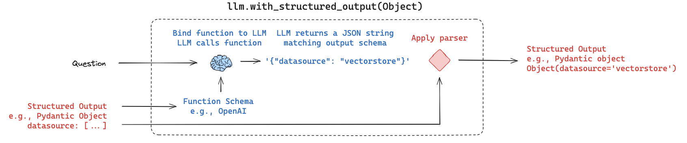
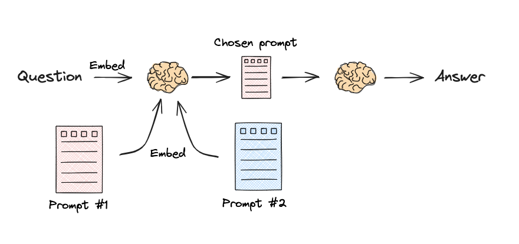

# ADVANCED RAG PIPELINES
## 2. Routing

> Selecting which retrieval source or prompt handles a query, before retrieval runs.

**Scope:** query → route selection. Not retrieval, ranking, or fusion.

## Why it exists

- One index can't serve heterogeneous corpora (code, tickets, PDFs, SQL).
- Retrieving from every index costs tokens and latency for no gain.
- Wrong index yields a confidently wrong answer, not an error.

## Core mechanism

1. Define candidate routes with distinct descriptions, schemas, or prompt templates.
2. Evaluate the incoming query against candidates (via LLM reasoning or embedding similarity).
3. Select the best-matching route (argmax or threshold-based fallback).
4. Dispatch the query to the designated retriever, tool, or prompt pipeline.

## Variants

| Variant | Mechanism | Cost | Best for |
|---|---|---|---|
| Logical routing | LLM function calling / structured output (e.g. Pydantic) to pick a data source | 1 LLM call (~200–800 ms, $) | Complex logic, fuzzy boundaries, cross-source dispatch (SQL vs Vector DB) |
| Semantic routing | Embed query and compare cosine similarity against route prompt/utterance embeddings | 1 embedding call (~5–50 ms) | Fast classification, prompt selection, high QPS, cost-sensitive routing |

## Minimal example

### 1. Logical Routing (Structured Output / Pydantic via Groq)



Uses LLM function calling / structured output with a Pydantic schema to select the target data source.

```python
from typing import Literal
from pydantic import BaseModel, Field
from groq import Groq
import json

class RouteQuery(BaseModel):
    """Route user query to the most appropriate data source."""
    datasource: Literal["python_docs", "sql_db", "general_rag"] = Field(
        description="Target destination based on query intent."
    )

client = Groq()

def logical_route(query: str) -> str:
    response = client.chat.completions.create(
        model="llama-3.3-70b-versatile",
        messages=[{"role": "user", "content": query}],
        tools=[{
            "type": "function",
            "function": {
                "name": "RouteQuery",
                "description": "Route query to appropriate data source",
                "parameters": RouteQuery.model_json_schema(),
            },
        }],
        tool_choice={"type": "function", "function": {"name": "RouteQuery"}},
    )
    args = json.loads(response.choices[0].message.tool_calls[0].function.arguments)
    return args["datasource"]
```

### 2. Semantic Routing (Embedding Similarity)



Embeds prompt templates or utterances and computes cosine similarity with the query embedding to select the best route.

```python
# Route prompt templates / descriptions
routes = {
    "math": "Solve mathematical equations, proofs, arithmetic, and calculations: {query}",
    "physics": "Explain physical laws, mechanics, thermodynamics, and astrophysics: {query}",
}

route_vectors = {name: get_embedding(template) for name, template in routes.items()}

def semantic_route(query: str) -> str:
    query_vec = get_embedding(query)
    # Pick the route prompt with highest cosine similarity
    return max(route_vectors, key=lambda r: cosine_similarity(query_vec, route_vectors[r]))
```

## Choosing

- **Logical routing**: Queries require reasoning, complex schemas, or dispatch to distinct tools/databases (e.g., SQL query generator vs. vector search).
- **Semantic routing**: Low-latency requirements (<50 ms), prompt template selection, or matching queries against representative examples/prompts.

## Failure modes

- **Out-of-distribution query** → Router forces an inappropriate route. Fix: add a `fallback`/`general` route and apply a confidence or similarity threshold.
- **Multi-intent query** → Single-label routing drops part of the query. Fix: allow multi-select lists in Pydantic schema or decompose query before routing.
- **Overlapping route descriptions/embeddings** → Ambiguous boundaries misroute queries. Fix: sharpen prompts/utterances to be mutually exclusive; fallback to logical routing when embeddings collide.

## Uncertainty

- Optimal cosine similarity thresholds in semantic routing are dataset-dependent and require empirical calibration `(unverified)`.
- Small embedding models can struggle to separate semantically adjacent prompt templates.

## References

- [LangChain RAG From Scratch: Routing](https://github.com/langchain-ai/rag-from-scratch) — conceptual foundation for logical and semantic routing.
- [Aurelio Labs semantic-router](https://github.com/aurelio-labs/semantic-router) — embedding similarity routing reference.
- [Groq Tool Calling Docs](https://console.groq.com/docs/tool-use) — structured function calling specification.