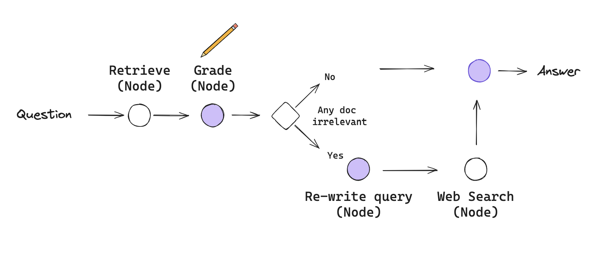

# ADVANCED RAG PIPELINES
## 5. Corrective RAG (CRAG)

> Grade retrieved documents, then correct course — augment with web search or rewrite the query before generating.



**Scope:** the CRAG paper's routing loop plus build notes for `RAG/Notebooks/CRAG.ipynb`. Not knowledge-refinement strips (skipped by design).

## Why it exists

- Retriever misses are silent: the LLM answers confidently from wrong or absent evidence.
- One-shot retrieval can't recover from a bad query or a thin index.
- Grading before generation turns "trust the retriever" into an explicit, testable decision.

## Core mechanism

1. Extract `(title, year)` from the query with structured output.
2. Fetch ground truth from MyAnimeList via Jikan (REST, no LLM); match with WRatio (fuzzy string score) ≥ 80.
3. Embed all docs (MAL + web) into a fresh per-run Chroma collection; retrieve top-k with the query.
4. One LLM call grades every doc: `relevant` bool + one-sentence reason.
5. Python — not the LLM — maps grades to `CORRECT | AMBIGUOUS | INCORRECT`.
6. Router augments (web search), rewrites (new query), or generates; one retry max.
7. Generate with inline `[n]` citations plus confidence warnings.

## What was built

| Piece | Decision |
|---|---|
| Models | gpt-oss-20b fast (extract/rewrite `low`, grade `medium`), gpt-oss-120b smart (`low`, generate only), bge-small-en-v1.5 CPU embeddings |
| State | 16-key `TypedDict`; `mal_docs`/`web_docs` use `operator.add` (append — `web_search` can fire twice); `retrieved_docs`/`doc_grades` stay replace, recomputed per pass |
| Nodes | 8: extract → jikan → (edge A) → index/retrieve → grade → (edge B) → generate \| bump_retry→web \| rewrite→web |
| Chroma | metadata `source/section/mal_id/title/url/score`; grades never stored in Chroma |
| Tracing | every node `def node(state, config)`; `run_name` + `stage:*` tags forwarded to `.invoke()` |
| Tests | extract (reasoning printed once), jikan (WRatio 100, 4 sections), grade (3 relevant + 1 irrelevant → AMBIGUOUS), 3 scenarios |
| Setup | `uv add langgraph langchain-tavily python-dotenv requests rapidfuzz grandalf`; kernel `rag` ("Python (rag)") registered |

## Choosing

Route after grading — checked in order:

| Condition | Route | Reason |
|---|---|---|
| `retry_count ≥ 1` | generate | hard loop guard: ≤ 2 web searches |
| CORRECT | generate | answerable now |
| AMBIGUOUS | bump_retry → web_search | query fine — add evidence |
| INCORRECT | rewrite_query → web_search | query wrong — same query returns same garbage |

## Minimal example

```python
def route_after_grading(state):
    if state["retry_count"] >= 1:               # guard first, always
        return "generate"
    return {"CORRECT":  "generate",
            "AMBIGUOUS": "bump_retry",    # bumps retry, then web_search
            "INCORRECT": "rewrite_query"}[state["retrieval_quality"]]
```

## Failure modes

- **Tavily span on a clean trace** → title-match bug → verify exact titles score WRatio 100.
- **Third web search appears** → `bump_retry` not bumping or guard removed → restore order above.
- **20k+ input tokens** → full character/staff lists → truncate to top 15 in `jikan_lookup`.
- **Grader says "The document is relevant"** → prompt too loose → demand query-specific reasons.
- **Reasoning bleeding into answers** → node read `response.reasoning` → always read `.content`.

## Uncertainty

- `api.jikan.moe` unreachable from this machine (TCP timeout, ports 80/443, 2026-10-06); `myanimelist.net` reachable — MAL scenarios unverified live.
- Reasoning text appeared in `additional_kwargs["reasoning_content"]`, not `response_metadata["reasoning"]`, with installed langchain-groq `(unverified across versions)`.
- Scenario 1's "zero AMBIGUOUS" expectation depends on grader judgment — not yet observed.
- CRAG paper's knowledge-refinement (strip partitioning) intentionally omitted.

## References

- [Corrective-RAG paper](https://arxiv.org/abs/2401.15884) — grading-then-correction flow.
- [Jikan docs](https://jikan.moe) — MAL wrapper, 60 req/min limit.
- [LangGraph how-tos](https://langchain-ai.github.io/langgraph/) — state reducers, config forwarding.
- [Groq reasoning docs](https://console.groq.com/docs/reasoning) — `reasoning_effort` and formats.
