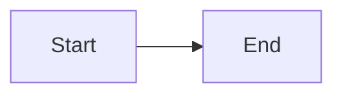

## Markdown Styling Cheat Sheet

A quick reference for formatting these notes.

### Headings

```md
# H1
## H2
### H3
```

### Emphasis

```md
*italic*   or   _italic_
**bold**   or   __bold__
***bold italic***
~~strikethrough~~

```
→ *italic*, **bold**, ***bold italic***, ~~strikethrough~~

### Lists

```md
- Bullet item
  - Nested bullet
1. Numbered item
2. Numbered item

- [ ] Unchecked task
- [x] Checked task
```

### Links & Images

```md
[Link text](https://example.com)

```

### Blockquotes

```md
> A quoted note or callout.
> 📌 Emoji works well for highlighting tips.
```

### Code

````md
Inline code: `variable_name`

```python
def hello():
    print("code block with language for syntax highlighting")
```
````

### Tables

```md
| Column A | Column B |
|----------|----------|
| value 1  | value 2  |
```

### Horizontal Rule

```md
---
```

### Diagrams (Mermaid — renders on GitHub)

````md

````

### Collapsible Section

```md
<details>
<summary>Click to expand</summary>

Hidden content goes here.

</details>
```

<details>
<summary>Example (rendered)</summary>

Hidden content goes here.

</details>

### Footnotes

```md
Here is a statement needing a source.[^1]

[^1]: This is the footnote text.
```

### Escaping Special Characters

```md
Use a backslash to show literal characters: \*not italic\*, \# not a heading
```
